# stock-analysis
Week 2 Bootcamp HW
# ***"Happy Tastes Good"***
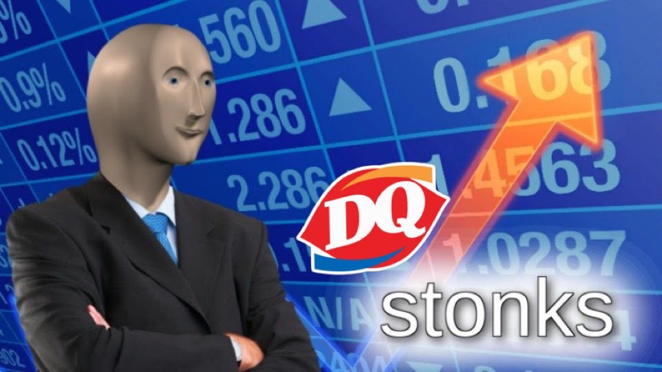

## Overview of Project
My good friend Steve just graduated with a degree in finance! He’s really excited about his achievement and is looking to utilize his education by providing clients with insight on stock investments. Steve’s parents couldn’t be prouder of their son, so they’ve decided to be his first clients. They want Steve to analyze their stock portfolio, which consists entirely of DAQO New Energy Corporation stocks. This is a company that makes silicon wafers for solar panels and the ticker for their stock is DQ. Steve’s parents met at Dairy Queen, so they didn’t need much more convincing beyond the name of the ticker. Sometimes making investment decisions based on a meme pay off… most of the time it doesn’t. Using data analytics, Steve and I are going to find out if his parents are making a sound financial decision. 

## Purpose
Putting all your money into one stock isn’t a sound investment strategy because it doesn’t make your portfolio diverse enough. In my opinion, even putting all your money into one sector of the stock market doesn’t count as being diverse. However, Steve’s parents believe in renewable energy and want to invest all their money into it. To improve their portfolio, Steve put together a dataset that contains 12 renewable energy stocks (including the DQ stock). My purpose in this project is to organize the dataset that Steve created. The dataset spans over two years and contains daily values for the stock. What we’re most interested in is the annual return and the total daily volume of each stock.

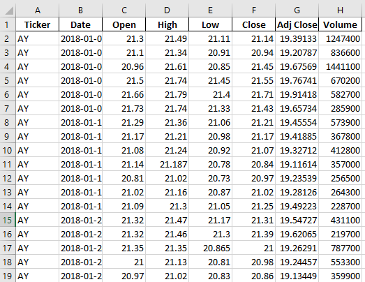

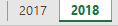

## Results
The dataset that Steve created is large and essentially raw data since it’s a lot of daily values. In order to compile all this information, I created a new sheet called “All Stocks Analysis.” Using an Excel tool called “Visual Basic for Applications (VBA),” I can pull specific information from the sheets that Steve created. My first step was to create a header row to specify the ticker identities, total daily volume, and the return. Next was to make an array of the tickers, so we can filter the data based on which ticker it belongs to. I also created an input box called yearValue, so the user of this sheet can search for data based on the year.

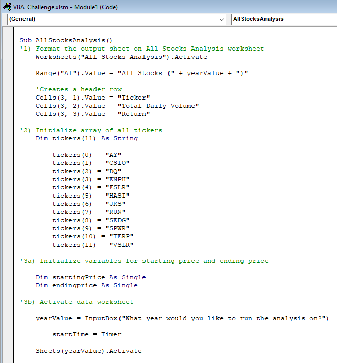

Once the tickers were defined, I needed to create an initial For loop that would loop through all the tickers (0 to 11 because there are 12 tickers). Next, using a nested For loop, I had to search through all the rows in the sheet and pull out any information that I specify. For the first step, I had to find out how many rows our dataset has. Using the RowCount code that I found on Stack Overflow, I could tell the For loop that there are 3,013 rows that we need to search through. My starting point is going to be 2 since the first row in the dataset is a header (2 to RowCount). Next, I used an If statement that will pull the value of the volume in that row if it matches the ticker that I’m looping through and increase total volume. Annual volume was the first piece of information that I wanted to pull because it can help you gain insight into a stock. High volume means more people are buying it and increasing demand. Meanwhile, lower volume means people are selling and decreasing demand. The final piece of information that I wanted was the annual return which can be found by dividing the ending price by the starting price of the stock. Using another If statement, I could find out if the current row is the first row with the selected ticker. If it is, then it would assign a starting price. Then using another If statement, I did the same thing to find an ending price. The only difference is checking if it’s the final row with the selected ticker.

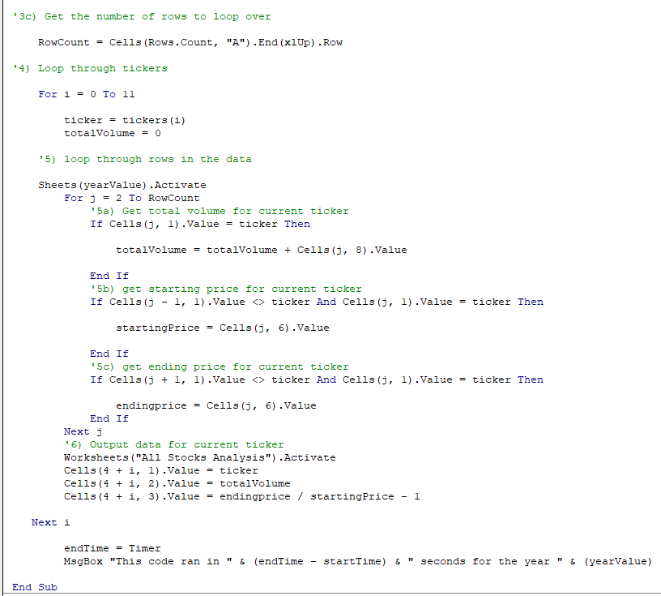

The final step in this macro was to activate the All Stocks Analysis sheet and output the information I collected. There’s also a timer function called startTime that tells me how long this macro took to collect all this data once the user inputs which year.

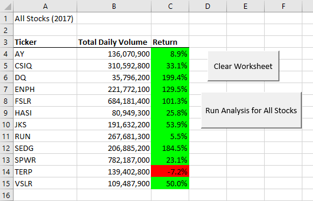
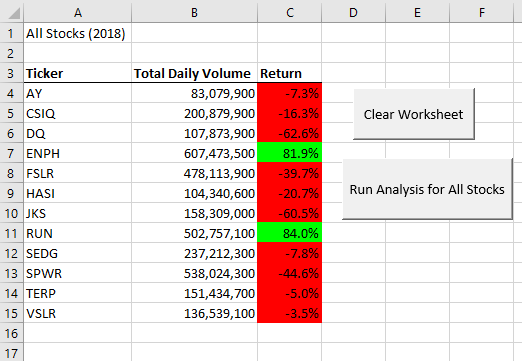
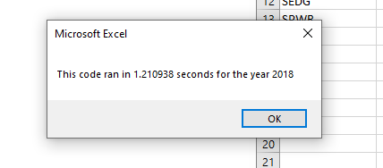

My code worked; however, it took too long to run. 1.21 seconds may not seem like a lot, but if I were analyzing hundreds (or thousands) of stocks the run time would add up. To save time, I refactored the code by getting rid of the nested For loop (a For loop within a For loop) and created a tickIndex that will increase in value when the macro has identified that the next row of data belongs to a different ticker. This way the macro doesn’t need to loop over the entire sheet each time for each ticker, it does the exact thing as the previous code in one loop. The result is a code that is 7x faster.

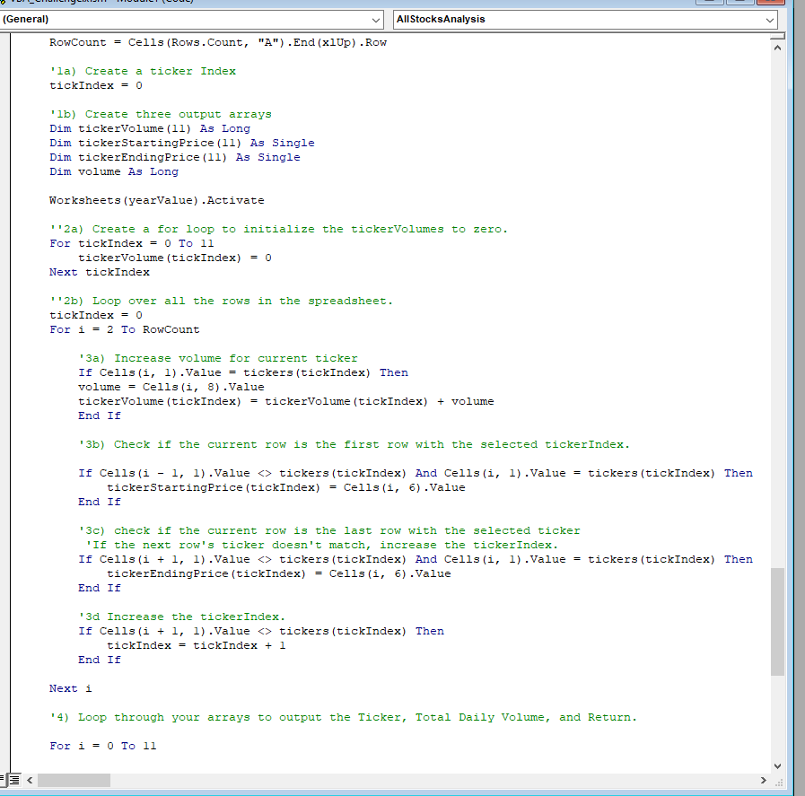
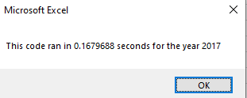

## Summary
Now that we have our results for 2017 and 2018, we can see that DQ performed well in 2017. However, in 2018 it did awful… hopefully they sold at the high in 2017. Even if they didn’t, the value of the stock that they hold should still be up by 136.8% (199.4% (2017) – 62.6% (2018)). So, in the end they did good! However, I would advise them to invest in a stock that isn’t so volatile since they’re middle-aged at this point. AY, CSIQ, HASI, and TERP are all comparably less volatile and a safer option.

Refactoring code can be a huge improvement to the code you’re working on. A good rule of thumb is the acronym DRY: Don’t Repeat Yourself. Cutting down on unnecessary code can make it faster and easier for others to understand your code. However, it can be easy to get error codes in the process once you start deleting and rewriting code. The most common error I had was “Subscript out of range.” I was trying to reference something that my code couldn’t.

My original code was conceptionally easier to understand since the initial For loop just looped through the tickers (0 to 11). Having a tickIndex made everything faster but adding in another variable to reference can get tricky if you mis-reference it. I got stuck at one point because my tickIndex kept increasing due to this exact problem. Which resulted in basically no data being send over to my All Stocks Analysis sheet because it went above the number of tickers that I have assigned in the array.

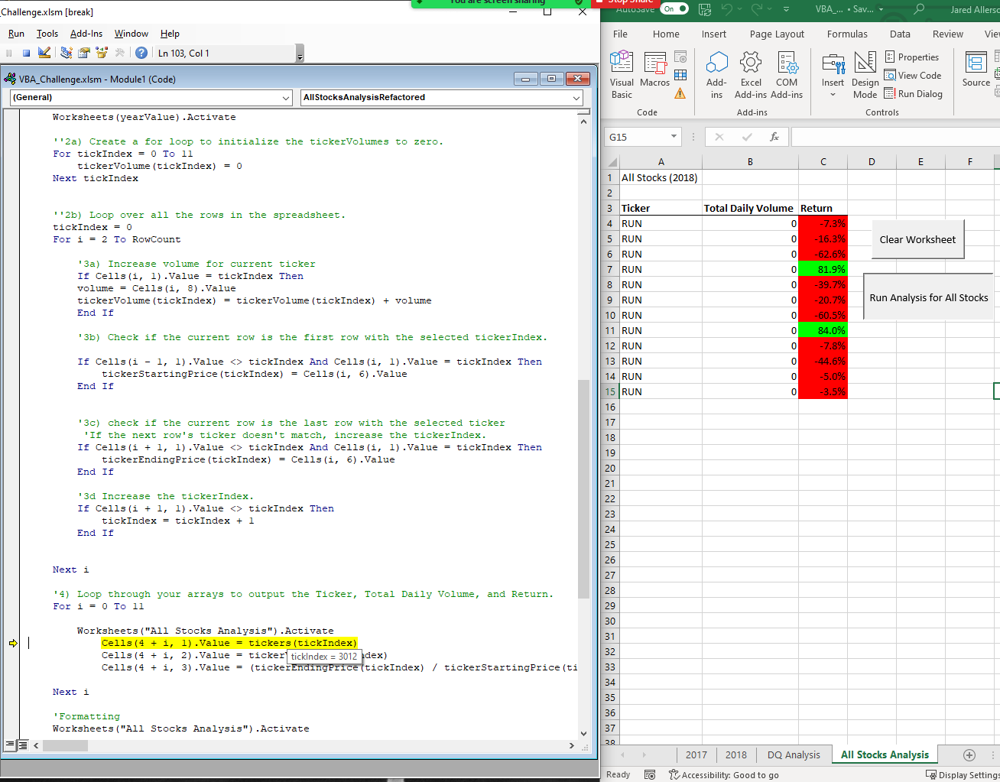